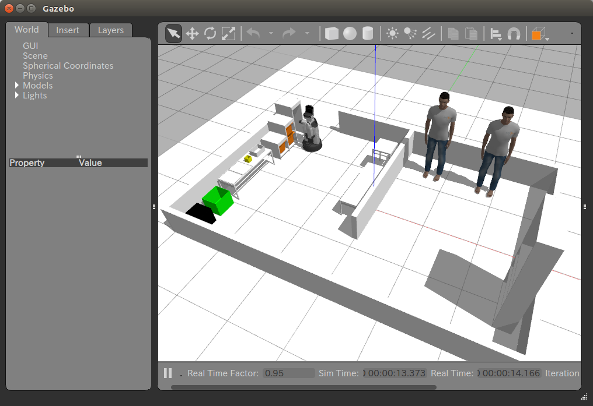

# hsrb_wrs_gazebo_launch

This package is for launching WRS simulator with TMC proprietary softwares, like navigation and perception and etc. To use this, you need to install tmc packages by following HSR manual in HSR.io.

But, there is **no guarantee** that this simulator totally complies with WRS rule book.


## how to use
```bash
$ mkdir -p catkin_ws/src
$ cd catkin_ws/src
$ git clone https://git.hsr.io/wrs2020/hsrb_wrs_gazebo_launch.git
$ git clone https://git.hsr.io/wrs2020/tmc_wrs_gazebo_world.git
$ git clone https://git.hsr.io/public_sim/tmc_gazebo_task_evaluators.git
$ cd ..
$ catkin_make
$ source devel/setup.bash
$ rosrun tmc_gazebo_task_evaluators setup_score_widget
$ roslaunch hsrb_wrs_gazebo_launch wrs_practice0_tmc.launch
```

Gazebo simulator with WRS2020 world will appear.



## task variations

Simulator with reduced number of object will be launched by using "wrs_practice0_easy_tmc.launch" launchfile and can be used for early development:

```bash
$ roslaunch hsrb_wrs_gazebo_launch wrs_practice0_easy_tmc.launch
```

Each simulator has different numbered launchfiles (wrs_practice0_easy_tmc.launch, wrs_practice1_easy_tmc.launch, wrs_practice2_easy_tmc.launch and wrs_practice0_tmc.launch, wrs_practice1_tmc.launch, wrs_practice2_tmc.launch) which allocates objects to slightly different positions.

You can use these variations to evaluate robustness of your algorithm.

## launch arguments

You can optionally set following arguments when you launch the simulator:

- seed
- fast_physics
- highrtf

"seed" is used to set random number seed to determine object placement. You can use this argument to test your algorithm with more variations.

If you set "fast_physics" to "true", the simulator will launch in fast physics mode.
Please note that in fast physics mode, we can enjoy faster simulation, on the other hand preciseness of the simulation will be reduced.

If "highrtf" is set to "true", the simulator will run in faster-than-realtime mode.

Each arguments can be used in combination as the follows:

```bash
$ roslaunch hsrb_wrs_gazebo_launch wrs_practice0_easy_tmc.launch seed:=10 fast_physics:=true highrtf:=true
```

# LICENSE

This software is released under the BSD 3-Clause Clear License, see LICENSE.txt.
